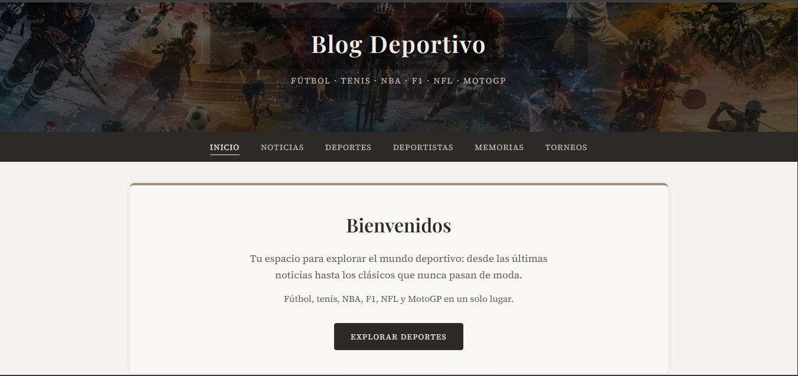
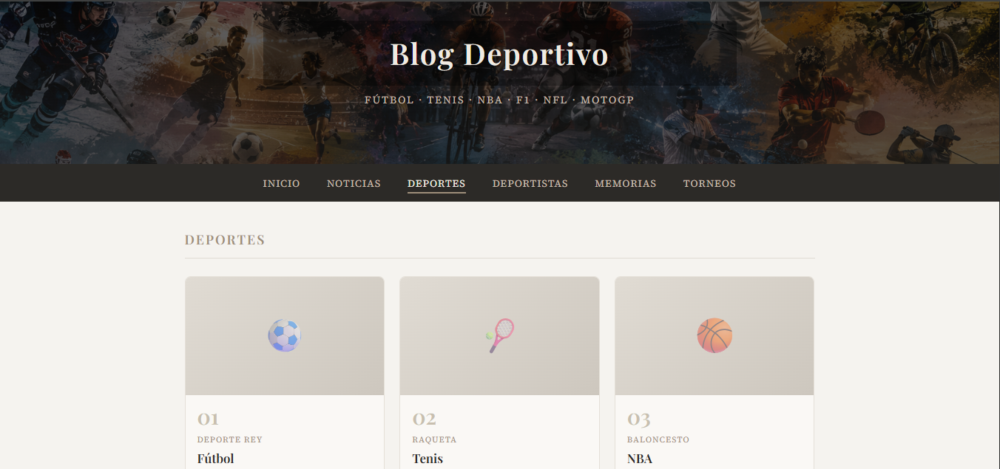
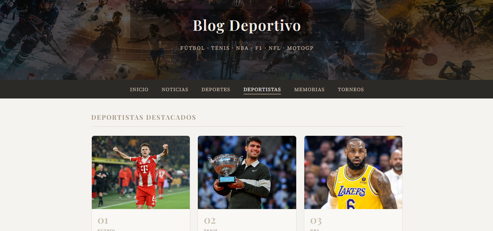

# 🏆 Blog Deportivo

Blog estático multi-página sobre el mundo del deporte: fútbol, tenis, NBA, F1, NFL y MotoGP. Construido con HTML, CSS y JavaScript puro, sin frameworks ni dependencias externas.

> **Demo en vivo:** `https://mariacamilazapata155-svg.github.io/BlogDeportivo/`




---

## Características

- Diseño editorial responsive con paleta cálida y tipografías Google Fonts
- Navegación sticky con menú hamburguesa en móvil
- Sección de deportes con tarjetas interactivas y panel lateral de detalle
- Perfiles de deportistas con estadísticas y noticias relacionadas
- Noticias filtrables por disciplina (JavaScript vanilla)
- Timeline de memorias históricas y calendario de torneos
- Meta tags SEO y Open Graph en todas las páginas

---

---

## 📸 Capturas

| Inicio | Deportes | Deportistas |
|--------|----------|-------------|
|  |  |  |

---

## Estructura del proyecto

```
Myblog/
├── index.html          # Inicio con hero y accesos rápidos
├── noticias.html       # Noticias con filtro por deporte
├── deportes.html       # Tarjetas interactivas por disciplina
├── deportistas.html    # Perfiles de atletas destacados
├── memorias.html       # Momentos históricos del deporte
├── torneos.html        # Competencias y calendario
├── styles.css          # Estilos globales
├── script.js           # Nav, menú móvil, filtros y footer
├── .gitignore
├── LICENSE               # MIT License
├── images/
│   ├── header.png      # Banner del encabezado
│   └── kimich.jpg      # Foto de deportista (ejemplo)
└── README.md
└── docs/
    └── screenshots/
        ├── home.png
        ├── deportes.png
        └── deportistas.png
```

---

## Cómo correrlo localmente

No requiere instalación. Abre `index.html` en tu navegador o usa Live Server:

```bash
# Opción 1 — abrirlo directamente
Doble clic en index.html

# Opción 2 — con Live Server (VS Code)
Instala la extensión Live Server → clic derecho en index.html → "Open with Live Server"
```

Se recomienda Live Server para evitar problemas con rutas de imágenes locales.

---

## Tecnologías

| Tecnología | Uso |
|------------|-----|
| HTML5 | Estructura semántica multi-página |
| CSS3 | Grid, variables CSS, diseño responsive |
| JavaScript (vanilla) | Nav activo, menú móvil, filtros, paneles |
| Google Fonts | Playfair Display + Source Serif 4 |

---

## Despliegue en GitHub Pages

1. Crea un repositorio en GitHub y sube el proyecto:

```bash
git init
git add .
git commit -m "Initial commit: Blog Deportivo"
git branch -M main
git remote add origin https://github.com/mariacamilazapata155-svg/BlogDeportivo.git
git push -u origin main
```

2. En GitHub ve a **Settings → Pages**.
3. En **Source**, selecciona la rama `main` y la carpeta `/ (root)`.
4. Guarda. En unos minutos tu sitio estará en `https://TU-USUARIO.github.io/Myblog/`.

5. Actualiza la URL de demo al inicio de este README.

### Otras opciones de despliegue

- **Netlify** — arrastra la carpeta en [netlify.com](https://netlify.com)
- **Vercel** — conecta el repositorio y despliega con un clic

---

## Paleta de colores

| Color | Hex | Uso |
|-------|-----|-----|
| Fondo principal | `#f5f3ef` | Cuerpo de la página |
| Superficie | `#faf8f5` | Tarjetas y artículos |
| Oscuro cálido | `#2c2a27` | Nav, footer, botones |
| Acento tierra | `#9e8f7a` | Bordes, etiquetas, títulos |
| Texto secundario | `#5a5550` | Párrafos |

---

## Cómo agregar contenido

### Nueva noticia

Copia un bloque `<article class="news-card">` en `noticias.html` y asigna `data-category`:

```html
<article class="news-card" data-category="futbol">
    <p class="news-card-tag">Fútbol</p>
    <h3>Título de la noticia</h3>
    <p class="news-card-date">Mes 2026</p>
    <p class="news-card-excerpt">Resumen breve...</p>
</article>
```

Categorías válidas para el filtro: `futbol`, `tenis`, `nba`, `f1`, `nfl`, `motogp`.

---

## Mejoras futuras

- [ ] Formulario de contacto
- [ ] Buscador de artículos
- [ ] Modo oscuro
- [ ] Optimizar imágenes (WebP)
- [ ] Dominio personalizado

---

---

## 🧠 Aprendizajes

Construir este blog desde cero me permitió consolidar fundamentos que en los cursos suelen darse por sentados. El mayor aprendizaje técnico fue entender que CSS Grid con `auto-fill` y `minmax()` resuelve layouts responsivos complejos sin necesidad de media queries adicionales ni frameworks como Bootstrap. También profundicé en la manipulación del DOM con JavaScript vanilla: los paneles laterales usan `classList.add/remove`, `data-*` attributes y control del scroll del body para crear una experiencia fluida sin librerías.

A nivel de arquitectura, aprendí a organizar un proyecto multi-página manteniendo consistencia visual entre archivos sin repetir lógica: el mismo `styles.css` y `script.js` sirven todas las páginas, y el menú activo se detecta automáticamente comparando `window.location.href`. También fue un ejercicio real de decisiones de diseño: elegir una paleta sobria con tonos tierra en lugar de colores saturados hizo que el contenido deportivo fuera el protagonista, no los estilos.

---


## Licencia

© 2026 MyBlog · Todos los derechos reservados.
